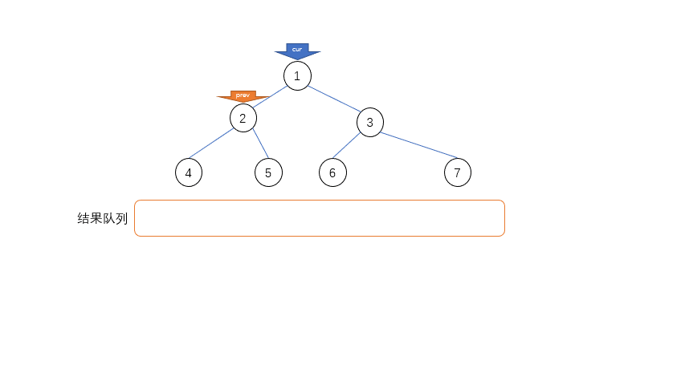

# 莫里斯遍历

   1. 简介
      - 常规的遍历算法递归、非递归（栈实现）的空间复杂度和时间复杂度均为O(N)而morris遍历可以将算法的空间复杂度降到O(1)
   2. 原理
      - 假设当前遍历的节点为x
      - 如果x无左子树，x向右移动(x = x.right)
      - 如果x存在左子树，寻找左子树上的最右节点记为pre
         - 如果pre的右子树为空，将pre的右子树赋值为x(pre.right = x)，x向左移动(x = x.left)
         - 如果pre的右子树不为空，则此时pre的右子树指向x，将pre的右子树置空(pre.right = null)，x向右移动(x = x.right)
      - 
